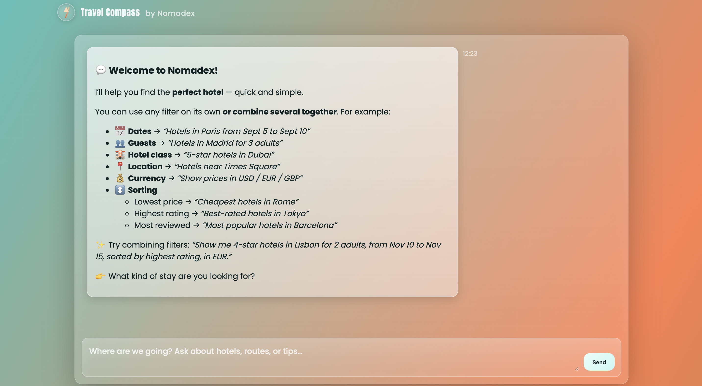
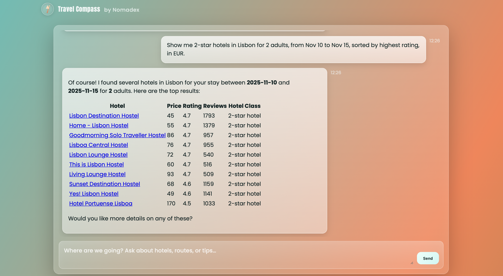
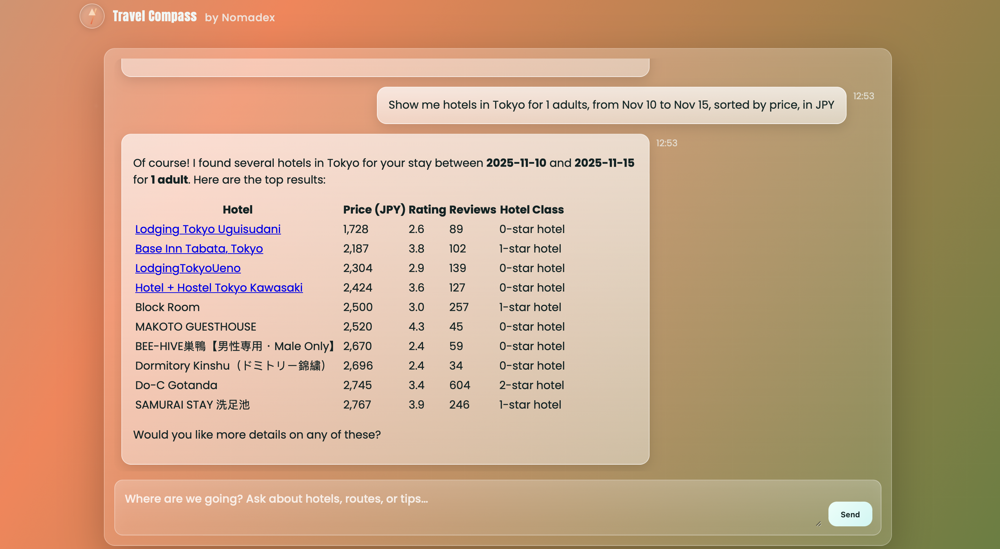

# Nomadex

A Django-based travel chatbot that can answer questions directly or call a hotel search tool (Google Hotels via SerpAPI) and synthesize a compact Markdown reply for users.

## Features
- Modern chat UI with safe Markdown rendering
- Orchestrator that decides tool-use vs. direct reply
- Hotel search via SerpAPI (Google Hotels)
- LLM responses via Hugging Face Inference API Router
- Clean pages

## Example prompts

## Stack
- Python 3.11+
- Django 4.2+/5.x
- Hugging Face Inference API (Router)
- SerpAPI (Google Hotels)
- Frontend: Vanilla JS, Marked.js, DOMPurify

## Structure
- `Nomadex/` – settings, URLs, WSGI/ASGI
- `chatbot/`
  - `views.py` – pages + `/api/chatbot/` endpoint
  - `services/`
    - `chatbot_api_service.py` – LLM prompts + API call
    - `orquestrator.py` – decision + flow
    - `serpi_service.py` – SerpAPI Google Hotels
- `templates/` – `chatbot.html`
- `requirements.txt`, `manage.py`, `db.sqlite3`

## How it works
1. Frontend posts `{ "message": "..." }` to `POST /api/chatbot/`.
2. Orchestrator asks the LLM whether to `use_tool` or `answer_directly`.
3. If tool is chosen, it queries SerpAPI for hotels and then requests a synthesized answer from the LLM.
4. Frontend renders Markdown; if reply is valid JSON with postcard fields, it renders a “postcard”.

By default, the synthesis prompt outputs a compact Markdown table (no emojis) with hotel name links.

## Environment variables (.env)
Create a `.env` in the project root:
- `SECRET_KEY` – Django secret key (fallback exists for dev)
- `HF_TOKEN` – Hugging Face token (required)
- `SERPAPI` – SerpAPI key (required)

Settings load these and will raise if missing.

## Setup
1. Python 3.11+ and virtualenv recommended
2. Install deps: `pip install -r requirements.txt`
3. Create `.env` with `HF_TOKEN` and `SERPAPI`
4. Migrate: `python manage.py migrate`
5. Run: `python manage.py runserver`
6. Open `http://127.0.0.1:8000/` (Home) and `/chat/` (Chat)

## Endpoints

- `GET /` – Chat UI
- `POST /api/chatbot/` – Chat API; returns `{ "reply": "..." }`

## SerpAPI parameters (tool)
- `q`, `engine=google_hotels`, `check_in_date`, `check_out_date`, `adults`, `sort_by`, `currency`
- Results mapped to keys: `nombre`, `precio`, `puntuacion`, `total_opiniones`, `descripcion`, `enlace_google`

## Deploy notes
- Set `ALLOWED_HOSTS`
- `DEBUG=False` in production
- Collect static to `staticfiles/`

## Troubleshooting
- Missing tokens → app raises at startup
- Mind API rate limits (HF/SerpAPI)